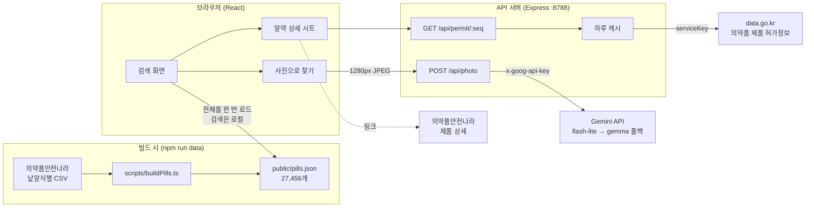
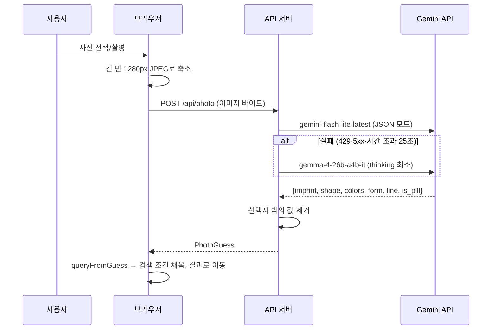

# 알약 렌즈 설계 문서

작성일: 2026-09-27 · 대상 커밋: `129a8b0` (3단계 완료 시점)

이 문서는 알약 렌즈가 **무엇을 어떤 근거로** 그렇게 만들었는지를 남깁니다. 사용법은 [README](../README.md)를 보세요.

---

## 1. 목표와 범위

**문제.** 집에 굴러다니는 알약, 약통에서 섞인 알약이 무슨 약인지 알기 어렵다. 약학정보원 같은 식별 검색이 있지만 모양·색·글자를 하나하나 골라야 하고, 찾은 뒤의 설명은 전문 용어로 된 긴 문서다.

**목표.**
1. 새겨진 글자·모양·색으로, 또는 **사진 한 장으로** 알약을 찾는다.
2. 찾은 약의 효능·복용법·주의사항을 **공식 문구 그대로**, 읽기 쉽게 나눠 보여준다.
3. 공개적으로 써도 되는 데이터만 쓴다.

**하지 않는 것.**
- 복용해도 되는지 판단하지 않는다. 결과는 후보 목록이며 "약사에게 확인하라"는 안내를 항상 함께 둔다.
- 설명문을 AI로 요약하거나 고쳐 쓰지 않는다. 틀린 의약품 정보를 만들 위험 때문이다 (→ [9. 결정 기록](#9-결정-기록)).

---

## 2. 전체 구조



| 부분 | 역할 | 키 필요 |
|---|---|---|
| `scripts/buildPills.ts` | 낱알식별 CSV를 받아 검색용 JSON 생성 | 없음 |
| 브라우저 | 검색·정렬·필터 전부, 결과 표시 | 없음 |
| `/api/permit` | 허가정보 API 대리 호출, XML → 화면용 구조 변환, 캐시 | data.go.kr |
| `/api/photo` | 사진 판독 (Gemini/Gemma) | Google AI |

검색을 브라우저에서 하는 이유는 [4장](#4-검색-설계), 서버를 두는 이유는 키 보호와 캐시다.

---

## 3. 데이터 파이프라인 (낱알식별)

### 3.1 출처

- `https://nedrug.mfds.go.kr/cmn/xls/downc/OpenData_PotOpenTabletIdntfc` (UTF-8 BOM CSV, 약 12MB, 34열)
- **API 키 없이** 전체를 받을 수 있다. 같은 데이터의 OpenAPI(`MdcinGrnIdntfcInfoService03`)는 이름·업체·품목번호로만 조회할 수 있고 모양·색 검색이 없어서, 어차피 전체를 받아 직접 걸러야 한다.
- 2026-09-27 기준 **27,456행**, 고유 품목 27,439개.

### 3.2 CSV의 특이점 (중요)

| 특이점 | 내용 | 대응 |
|---|---|---|
| **표준 CSV가 아님** | 값을 따옴표로 감싸지 않는데, 성상 칸에 날것의 `"`가 들어 있다 (예: `한면에“SZ"와다른한면에”231“이새겨진…`). | 한 줄 = 한 레코드, 쉼표로만 나눈다 (`src/lib/csv.ts`). 모든 행이 정확히 34칸으로 나뉘는 것을 확인했다. |
| 품목번호 중복 | 한 품목에 함량별 알약이 여러 행 (예: 라믹탈정 25·50·100mg이 3행, 레날리드정 7행). 모양·글자가 서로 다르다. | 모두 남기고 `id`를 `품목번호-순번`으로 따로 둔다. 허가정보 조회는 `seq`(품목번호)로 한다. |
| `-` = 값 없음 | 모든 칸에서 빈 값을 `-`로 표기 | `clean()`에서 빈 문자열로 |
| 분할선이 글자 칸에 | `분할선앞/뒤` 칸은 거의 비어 있고, 표시(식별문자) 글자 안에 `분할선`·`십자분할선`으로 적혀 있다 (예: `V분할선T`). `마크`는 로고를 뜻한다. | 분할선 종류를 글자에서 추출하고, 검색·비교 때는 그 단어들을 지운다. 화면에는 `V \| T`, `(마크) NVT`처럼 보여준다. |
| A를 그리스 문자로 표기 | 873개 알약이 식별문자의 A를 `Λ`(또는 `∧`)로 적는다 (예: `ΛJ2`, `COΛ`). 처음에는 기호로 보고 지워서 "AJ2"로 검색해도 찾지 못했다. 실제 사진 정답표를 만들다가 발견했다. | 비교할 때 `Λ`·`∧`를 A로 읽는다. |
| 색 조합·수식어 | `빨강\|투명`, `분홍\|진한`, 앞/뒤 색이 다름 | 앞·뒤 색을 합치고 `진한`·`옅은`은 버린다. 2색 이상인 알약은 2,836개. |
| 제형 표기 | `필름코팅정`, `경질캡슐제\|산제` 등 46종 | 검색용 4분류(정제·경질캡슐·연질캡슐·기타)로 묶는다. 값이 없으면 성상 글로 추정한다. |

> **사고 기록.** 처음에는 RFC 4180 파서(따옴표 안의 쉼표·줄바꿈 처리)를 썼다. 이 파서는 첫 번째 날것의 `"`를 만나면 다음 `"`까지 수천 줄을 한 값으로 삼켜서, **27,456행 중 9,568행(35%)만** 남았다. 오류 없이 조용히 누락됐고, "대웅제약 코메키나캡슐이 health.kr에서는 나오는데 여기서는 안 나온다"는 사용자 보고로 발견했다. 재발을 막기 위해 다음을 넣었다.
> - 칸 수가 헤더와 다른 행은 버리고, **버린 행이 1%를 넘으면 빌드를 실패**시킨다.
> - 실제 문제 행을 그대로 쓴 회귀 테스트를 추가했다 (`pillData.test.ts`).

### 3.3 `Pill` 스키마 (`src/types.ts`)

| 필드 | 원본 칸 | 비고 |
|---|---|---|
| `id` | 품목일련번호(+순번) | 화면의 React key |
| `seq` | 품목일련번호 | 허가정보·의약품안전나라 연결 키 (9자리) |
| `name`, `company` | 품목명, 업소명 | |
| `image` | 큰제품이미지 | 의약품안전나라 이미지 URL (전 행 존재) |
| `front`, `back` | 표시앞, 표시뒤 | 원문 유지 |
| `shape` | 의약품제형 | 원형 10,651 · 타원형 7,893 · 장방형 7,366 · 기타 498 · … · 반원형 3 |
| `colors` | 색상앞 + 색상뒤 | |
| `line` | 분할선 칸 + 표시 글자 | 없음 22,637 · 일자 4,589 · 십자 213 · 기타 17 |
| `form` | 제형코드명 (+성상) | 정제 21,764 · 경질캡슐 3,788 · 연질캡슐 1,817 · 기타 87 |
| `formName`, `otc`, `className`, `chart` | 제형코드명, 전문일반구분, 분류명, 성상 | 표시용 |
| `size` | 크기 장축·단축·두께 | 값이 비정상이면 `null` (106개) |

결과 파일은 약 12.5MB(gzip 1.7MB)이고, 저장소에 포함한다 (→ [9장](#9-결정-기록)).

---

## 4. 검색 설계

### 4.1 왜 브라우저에서 검색하나

- 전체가 2만 7천 건이라 한 번 받아 두면 필터가 **입력 즉시**(수 ms) 반영된다.
- 원본 API에 모양·색 검색이 없어 서버에서 해도 결국 같은 계산이다.
- 서버와 키 없이도 핵심 기능이 동작한다.

### 4.2 정규화

| 대상 | 규칙 | 예 |
|---|---|---|
| 식별문자 | `십자분할선`·`분할선`·`마크` 제거 → `Λ`·`∧`를 A로 → 대문자 → 영숫자·한글만 남김 | `D-W`, `d.w` → `DW` / `V분할선T` → `VT` / `ΛJ2` → `AJ2` |
| 헷갈리는 글자 | 비교할 때 `O`→`0`, `I`→`1` | `ZO2` = `Z02` (사진 판독 오류 사례) |
| 제품명 | 대문자, 공백 제거 | `타이레놀 정` → `타이레놀정` |

### 4.3 매칭 규칙

- **글자 입력**은 공백으로 나눈 토큰마다:
  - 식별문자 점수: 앞/뒤 중 하나와 정확히 같으면 0, 그걸로 시작하면 1, 포함하면 2, 앞+뒤를 이어 붙인 문자열에 포함되면 3 (`YHLT`처럼 붙여 쓴 입력용). 모든 토큰이 맞아야 하고, 점수는 토큰별 합이다.
  - 식별문자가 안 맞으면 **제품명**을 본다. 모든 단어가 이름에 있어야 하고, 점수는 100 + (이름이 첫 단어로 시작하면 0, 아니면 1). 식별문자 일치가 항상 먼저 나오게 하기 위해서다.
- **모양·제형·분할선**: 고른 것 중 **하나라도** 맞으면 통과 (한 알약은 모양이 하나뿐이므로).
- **색상**: 고른 색을 **모두** 가진 알약만 통과. 두 색 캡슐(예: 빨강+하양)을 좁히기 위해서다. 대신 색을 잘못 고르면 결과에서 빠질 수 있어서, 결과가 없을 때 "비슷한 색으로 바꿔 보라"는 안내를 보여준다.
- 조건이 하나도 없으면 결과를 내지 않는다 (전체 2만 7천 개 나열은 쓸모가 없다).
- 정렬: 점수 오름차순, 같으면 이름 가나다순. 화면에는 30개씩 보여준다.

### 4.4 성능

- 로드할 때 한 번 정규화 값(`nf`, `nb`, `nn`)을 미리 계산한다 (`indexPills`).
- 입력은 `useDeferredValue`로 처리해 타이핑이 막히지 않게 한다.
- 로컬 개발 서버에서 `pills.json` 로드는 약 0.16초가 걸렸다.

---

## 5. 약 설명 (허가정보)

### 5.1 API

- `https://apis.data.go.kr/1471000/DrugPrdtPrmsnInfoService08/getDrugPrdtPrmsnDtlInq08?serviceKey=…&type=json&item_seq=…`
- 한 건 조회에 약 1초가 걸린다. 전체 42,973개 품목.
- **파라미터 함정.** 모르는 파라미터(예: 대문자 `ITEM_SEQ`)는 **오류 없이 무시하고 전체 목록**을 돌려준다. 그래서 받은 결과가 요청한 `ITEM_SEQ`와 일치하는지 반드시 확인하고, 다르면 "없음"으로 처리한다. 이 경우를 테스트로 고정해 두었다.
- 키 오류는 JSON이 아닌 XML로 온다 (`SERVICE_KEY_IS_NOT_REGISTERED_ERROR` 등). 메시지만 뽑아 쓴다.

### 5.2 첨부문서 XML 파싱 (`server/docXml.ts`)

효능(EE)·용법(UD)·주의사항(NB)은 다음 형태의 XML 문자열로 온다.

```xml
<DOC title="사용상의주의사항" type="NB">
  <SECTION title="">
    <ARTICLE title="1. 경고">
      <PARAGRAPH tagName="p"><![CDATA[본문 &lt;주의&gt;]]></PARAGRAPH>
      <PARAGRAPH tagName="table"><![CDATA[<tbody><tr><td colspan="2">…</td></tr></tbody>]]></PARAGRAPH>
      <PARAGRAPH tagName="br" />
    </ARTICLE>
  </SECTION>
</DOC>
```

| 규칙 | 이유 |
|---|---|
| 태그 속성을 따옴표 단위로 읽는다 | XML 속성 값에는 `>`가 그대로 들어갈 수 있다 (예: `title="용량 > 10mg"`). |
| 제목만 있는 `ARTICLE`도 남긴다 | 효능 문서는 항목 제목 자체가 내용인 경우가 많다 (`1. 고칼륨혈증…`). |
| `p`/`br`는 줄바꿈으로, 나머지 HTML 태그는 제거 | 표 셀 안에 `<p>`가 섞여 있다 (`25 mg <p>(1일 1회)</p>`). |
| `sup`/`sub`는 유니코드 첨자로 | `m<sup>2</sup>` → `m²`. 바꿀 수 없으면 `^(…)`. |
| 엔티티 해석 | `&nbsp;` `&lt;` `&#x2022;` `&micro;` 등 |
| 표는 행·셀·`colspan`/`rowspan`만 보존 | `style` 같은 속성은 버린다. |

결과 타입: `DocArticle { title, blocks: ({kind:'text',text} | {kind:'table',rows})[] }`

### 5.3 그 밖의 필드

- `MATERIAL_NAME` (`총량 : …|성분명 : …|분량 : …|단위 : …;…`) → 주성분 목록(이름·분량·성분정보). 비어 있으면 `MAIN_ITEM_INGR`의 이름만 쓴다.
- `INGR_NAME` (`[M100390]규화미결정셀룰로오즈|…`) → 첨가제 목록 (코드 제거).
- `CANCEL_NAME`이 `정상`이 아니면(취소·취하) 화면에 경고를 띄운다.

### 5.4 캐시와 키 보호

- 품목별 결과(없음 포함)를 **하루** 동안 메모리에 둔다. 개발계정 한도가 하루 10,000건이라서다. 같은 품목을 동시에 요청하면 외부 호출은 한 번만 하고, 실패한 결과는 저장하지 않는다.
- 서비스키는 서버의 `.env`에만 있고, 오류 응답에는 `permit_failed`만 싣는다. 서버 로그에도 요청 URL을 남기지 않는다.

### 5.5 화면

| 구역 | 기본 상태 | 이유 |
|---|---|---|
| 효능·효과, 용법·용량 | 펼침 | 보통 짧고 가장 먼저 필요하다 |
| 사용상의 주의사항 | 접힘, 항목별로 다시 접힘 | 수천~수만 자 (라믹탈정 49,000자) |
| 성분 | 접힘 | 주성분 함량, 첨가제 |
| 보관·사용기간 | 표 | |

허가정보에 없는 약은 "설명을 찾지 못했어요"와 의약품안전나라 링크를, 불러오기에 실패하면 "다시 시도" 버튼을 보여준다.

**적용 범위.** 무작위 60개 품목 중 53개(88%)는 허가정보가 있었고(그중 5개는 취소·취하 상태), 7개는 없었다.

---

## 6. 사진으로 찾기

### 6.1 흐름



### 6.2 모델 선택 시험

식약처 알약 사진에서 한쪽 면만 잘라 기울이고 배경을 깐 **가상 휴대폰 사진 12장**(원형·타원·장방·삼각·오각·사각·팔각·마름모, 정제·경질·연질캡슐)으로 비교했다.

| 모델 | 글자 | 모양 | 제형 | 색(정확히) | 평균 시간 |
|---|---|---|---|---|---|
| **gemini-flash-lite-latest** | **10/12** | **11/12** | 12/12 | 7/12 | **1.9초** |
| gemma-4-26b-a4b-it (thinking 최소) | 9/12 | 10/12 | 12/12 | 6/12 | 3.9초 |

- flash-lite를 기본으로 쓰고, 한도 초과 등으로 실패하면 gemma로 넘어간다.
- 글자를 AI가 이미 잘 읽어서 **CLOVA OCR은 쓰지 않았다** (외부 API 하나를 줄임).
- 참고로 gemma-4-31b는 원재료 렌즈 때 측정해 보니 텍스트 한 건에 40~80초가 걸렸고, 500·503(과부하) 오류도 나서 후보에서 뺐다.

### 6.3 판독 결과를 검색 조건으로 바꾸기 (`queryFromGuess`)

**글자만 거르는 조건으로 쓰고, 모양·제형·색은 순서에만 반영한다** (`PillQuery.prefer`).

1. 글자를 읽었고 그 글자로 결과가 있으면 → 글자로 거르고, 모양·제형·색이 맞는 알약을 앞으로 당긴다.
2. 글자가 없거나 읽은 글자로 결과가 없으면 → 모양(비슷한 모양 포함)·제형으로 거른다. 화면에 그렇게 알린다.

순서 점수는 식별문자 점수(정확 0 · 앞부분 1 · 포함 2)에 더한다. 모양이 다르면 +2(비슷한 모양이면 +1), 제형이 다르면 +2, 색이 하나도 안 겹치면 +1이다. 그래서 글자가 같은 알약끼리는 모양·제형·색이 맞는 쪽이 앞선다.

**왜 거르지 않나.** 처음에는 모양·제형도 거르는 조건으로 썼다(결과가 0개일 때만 하나씩 풀었다). 실제 촬영 사진 평가(6.5)에서 두 가지 문제가 드러났다.
- AI의 모양 오답 22건이 **모두 장방형을 타원형으로** 본 것이었다. 결과가 0개가 아니면 조건을 풀지 않으므로, 글자를 맞게 읽고도 정답이 걸러진 경우가 11건이었다.
- 글자가 같은 알약이 여럿이면 순위가 이름순으로 정해졌다. 예를 들어 `HM/10`은 수바스트정(원형·분홍), 몬테잘정(사각형·주황), 토바스트정(타원형·노랑)에 모두 있는데, 모양과 색을 알아도 순서에 쓰이지 않았다.

**색.** AI가 말하는 색 이름은 데이터와 자주 다르다 (가상 사진 12장 중 5장. 데이터 `주황` ↔ AI `노랑`, `분홍` ↔ `하양` 등). 색 필터는 고른 색을 **모두** 가져야 통과하므로 거르는 조건으로는 쓰지 않는다. 대신 순서 점수에만 쓰고, 사용자가 **색도 조건에 넣기**를 누르면 그때 거른다.

**비슷한 모양.** `장방형 ↔ 타원형`을 한 묶음으로 본다(`similarShapes`). 사람도 헷갈리는 조합이고, 실제 평가의 모양 오답이 모두 이 경우였다.

### 6.4 가상 사진 시험 결과 (초기)

식약처 알약 사진을 잘라 만든 가상 사진 12장, 모양·제형을 거르는 조건으로 쓰던 때의 결과다.

| 지표 | 결과 |
|---|---|
| 정답이 1위 | 8/12 |
| 정답이 5위 안 | 11/12 |
| 평균 응답 | 1.6초 |
| 실패 사례 | `J10`을 `10`으로 읽어 후보 1,850개 중 715위 |

가상 사진은 식약처 사진을 그대로 잘라 써서 글자가 선명했다. 실제 촬영 사진(6.5)에서는 훨씬 낮게 나왔다.

### 6.5 실제 촬영 사진 평가 (`npm run eval:photos`)

**데이터.** 식약처·약학정보원 「인공지능 개발을 위한 알약 이미지 데이터」 샘플. 22개 품목을 휴대폰으로 돌려 가며 앞면·뒷면을 찍은 사진 920장(배경 제거, 3,700×2,800px)이다. `npm run sample:setup`으로 받는다.

- 약학정보원 공지의 다운로드 링크는 `http://`라 HTTPS 페이지에서 브라우저가 막는다. 같은 서버의 `https://` 주소는 정상이라 스크립트는 그 주소를 쓴다.
- 원본은 `.egg`(알집 형식)라 반디집 콘솔(`bz`)로 푼다.

**정답표 만들기.** 샘플에는 폴더 이름(식별표시 접수번호, 예: `29002`)과 품목을 잇는 목록이 없다. 사용설명서에는 목록이 있다고 되어 있지만 샘플과 앱 소스(`source.Egg`)에 들어 있지 않다. 그래서 다음처럼 직접 만들었다 (`eval/kpic-sample-labels.csv`).
1. 폴더마다 사진 4장을 AI로 판독해 후보를 뽑는다.
2. 사진과 후보의 식약처 사진을 한 장에 나란히 놓고 **사람이 눈으로** 글자·모양·색을 대조한다. 후보가 틀린 11개는 사진에서 직접 읽은 글자로 다시 찾았다.
3. 22개 중 21개는 확실하다. 티뮤즈연질캡슐(`41225`)은 글자(TMS)는 같지만 사진은 베이지에 빨간 글씨, 식약처 사진은 적갈색에 흰 글씨라 **불확실**로 두고 전체 수치에서 뺀다.

정답표를 만들다가 식별문자의 A를 `Λ`로 적는 문제(3.2)를 발견했다.

**방법.** 4장마다 1장(230장)을 앱과 같은 과정으로 처리한다: 1280px JPEG로 줄임 → 판독(flash-lite, 실패 시 gemma) → `queryFromGuess` → `searchPills` → 정답 순위. 앞면·뒷면은 사용설명서대로 사진 순서의 앞 절반·뒤 절반으로 나눈다.

**결과** (정답 확실 220장). 판독 결과를 저장해 두고, 6.3의 순서 반영 방식으로 바꾼 뒤 **같은 판독 결과로** 다시 매겼다 (API를 다시 부르지 않음).

| 구분 | 방식 | 1위 | 5위 안 | 30위 안 | 못 찾음 | 글자 정확 |
|---|---|---|---|---|---|---|
| 전체 | 이전 (모양·제형으로 거름) | 26% | 37% | 46% | 18% | 52% |
| 전체 | **현재 (순서에만 반영)** | **40%** | **45%** | **52%** | **11%** | 52% |
| 앞면 | 이전 | 44% | 59% | 68% | 19% | 76% |
| 앞면 | **현재** | **58%** | **65%** | **75%** | **14%** | 76% |
| 뒷면 | 이전 | 8% | 15% | 24% | 16% | 28% |
| 뒷면 | **현재** | **22%** | **24%** | **29%** | **8%** | 28% |

평균 응답은 4.9초였다 (한도 초과로 gemma로 넘어간 호출 포함).

**해석.**
- **뒷면이 약하다.** 한쪽 면에만 글자가 있는 알약이 많아, 뒷면 사진에서는 글자를 읽을 수 없다(글자 정확 28%). 화면에 "글자가 새겨진 면을 찍으면 훨씬 정확해요"라고 안내한다.
- **남은 실패는 대부분 글자를 틀리게 읽은 경우다** (못 찾은 39건 중 23건). 작게 새겨진 음각 글자, 사진 속에서 작게 찍힌 알약에서 많았다.
- 글자가 없는 알약(멀티큐텐플러스정: 로고+분할선)은 모양·제형만으로는 후보가 수천 개라 사진으로 찾기 어렵다.
- **주의.** "장방형 ↔ 타원형" 묶음은 이 평가 데이터를 보고 정했으므로, 다른 사진에서는 개선 폭이 조금 작을 수 있다. 점수 가중치(+2/+1)는 이 데이터로 조정하지 않았다.
- 이 샘플은 배경이 제거되어 있다. 책상·손 같은 배경이 있는 실제 사용 사진은 아직 평가하지 않았다.

### 6.6 개인정보

사진은 서버 메모리에서 판독에만 쓰고 저장하지 않는다. Google AI로 전송된다는 사실을 버튼 아래에 안내한다.

---

## 7. 화면 구성

```
App
├─ PhotoSearch        사진 버튼, 판독 중/결과/오류 카드
├─ SearchPanel        글자·제품명 입력, 모양(아이콘) · 색(견본) · 제형 · 분할선 칩
├─ 결과 목록           PillCard × 30 (+ 더 보기), 결과로 이동하는 떠 있는 버튼
├─ Disclaimer         참고용 안내, 데이터 기준일
└─ PillSheet          (알약을 누르면) 사진, 식별 정보, PermitView, 의약품안전나라 링크
    └─ PermitView     허가정보 불러오기 · 접이식 문서 · 성분 · 보관
```

- 모바일 우선 설계로, 최대 폭은 480px이다. 휴대폰 크기(390px)에서 가로 스크롤이 생기지 않는 것을 확인했다. 긴 표는 표 안에서만 가로로 스크롤한다.
- 디자인은 원재료 렌즈와 같은 계열이다 (크림 + 그린, Pretendard/Fraunces).

---

## 8. 테스트 전략

`npm test` — 8개 파일, 82개 테스트. 사진 판독 정확도는 단위 테스트가 아니라 `npm run eval:photos`로 따로 잰다 (6.5).

| 파일 | 대상 |
|---|---|
| `src/lib/pillData.test.ts` | CSV 파싱 (실제 문제 행 회귀 포함), 색·제형·분할선 추출, 식별문자 정규화·표시 |
| `src/lib/search.test.ts` | 정렬 순서, 기호·붙여쓰기·O/0, 제품명 검색, 필터 조합, 사진 판독 → 조건 완화 |
| `src/App.test.tsx` | 글자·이름·필터 검색, 상세 시트, 사진 흐름(성공·실패·알약 아님) |
| `src/ui/PermitView.test.tsx` | 펼침/접힘, 표 `colspan`, 없음·취하·재시도 |
| `server/docXml.test.ts` | 엔티티, 첨자, 표, 속성 안의 `>`, **실제 코메키나캡슐 응답** |
| `server/permit.test.ts` | 성분 파싱, 결과 변환, 파라미터 무시 함정, 키 오류(키 노출 없음) |
| `server/vision.test.ts` | 응답 정리, 요청 형식(키는 헤더로), 모델 폴백 |
| `server/app.test.ts` | 라우트 상태 코드, 캐시, 오류 내용 비노출, 사진 업로드 |

- 외부 API는 모두 `fetch` 모의로 대체하고, 실제 응답은 `server/fixtures/`에 저장해 쓴다.
- 브라우저 확인은 Edge 헤드리스를 DevTools 프로토콜로 조종해 390×844 화면에서 입력·클릭·업로드를 하고 스크린샷으로 검증했다 (저장소에는 포함하지 않음).

---

## 9. 결정 기록

| 결정 | 대안 | 이유 |
|---|---|---|
| 식약처 공공데이터만 사용 | 약학정보원(health.kr) 크롤링 | health.kr 약관이 무단 복제·배포를 금지한다. 식약처 데이터는 이용허락범위에 제한이 없고, 식별 항목도 같다. |
| 설명은 허가정보 | e약은요 | 사용자가 e약은요 말고 다른 출처를 원했다. 허가정보는 전문의약품을 포함해 허가된 약 전체(42,973개 품목)를 다룬다. e약은요는 일반의약품 중심으로 알려져 있지만, 이 프로젝트에서 직접 확인하지는 않았다. |
| DUR은 보류 | 허가정보 + DUR | DUR은 설명 없이 금기 정보만 있고, 금기가 있는 약만 들어 있다. 허가정보의 주의사항에 같은 내용이 글로 들어 있으므로, "임부금기" 같은 배지가 필요해지면 추가한다. |
| 설명을 AI로 요약하지 않음 | AI 요약 | 원재료 렌즈에서 Gemma에 붙인 Google 검색이 실제로는 한 번도 실행되지 않았고(검색 기록 0건), 출처 URL도 모델이 직접 적은 것이었다. 게다가 한 건에 60~80초가 걸렸다. 의약품 정보는 틀리면 위험하므로 공식 문구를 그대로 쓰고, 접이식 구성으로 읽기 쉽게 만든다. |
| 검색은 브라우저에서 | 서버 검색 | 즉시 반응, 키 없이 동작, 원본 API에 모양·색 검색 없음 (4.1) |
| `pills.json` 저장소 포함 | 빌드 때 생성 | 원본 사이트가 바뀌거나 막혀도 재현할 수 있게 하고, 배포 환경에서 외부 다운로드에 의존하지 않기 위해 |
| CLOVA OCR 미사용 | OCR + AI | AI만으로 글자를 12장 중 10장 맞게 읽었다. 외부 API와 키가 하나 줄어든다. |
| 사진의 모양·제형·색은 거르지 않고 순서에만 반영 | 거르는 조건으로 사용 | 실제 촬영 사진에서 모양 오판(장방형→타원형)으로 정답이 걸러졌고, 색 이름은 데이터와 자주 다르다. 바꾼 뒤 1위 26% → 40% (6.3, 6.5) |
| API 서버 포트 8788 | 8787 | 같은 PC의 원재료 렌즈 서버가 8787을 쓴다. |

---

## 10. 한계와 다음 할 일

| 항목 | 현재 | 다음 |
|---|---|---|
| 실제 사진 | 배경을 지운 촬영 사진 220장으로 평가 (1위 40%, 앞면 58%) | 배경이 있는 휴대폰 사진으로 평가. 앞·뒷면 두 장을 찍어 합쳐 판독 (뒷면만 찍으면 1위 22%) |
| 사진 한도 | Gemini 무료 한도를 원재료 렌즈와 나눠 씀 | 한도를 넘으면 gemma 폴백. 필요하면 결제 계정이나 캐시 도입 |
| 데이터 크기 | 12.5MB 한 파일 (gzip 1.7MB) | 검색에 필요한 칸만 먼저 받고, 성상·분류 같은 상세 칸은 나중에 받도록 나누기 |
| 허가정보 누락 12% | 안내 + 외부 링크 | e약은요를 보조 출처로 두는 방안 검토 |
| 배포 | 정적 파일과 API 서버가 분리됨 | Express에서 `dist/` 서빙 또는 서버리스 함수로 이전 |
| 경고 배지 | 없음 | DUR로 임부·연령·병용 금기 배지 |
| 첨가제 알림 | 첨가제 목록만 표시 | 원재료 렌즈의 "내 알레르기" 기능을 첨가제(유당, 색소 등)에 연결 |
| 오프라인 | 없음 | PWA로 알약 데이터 캐시 |

